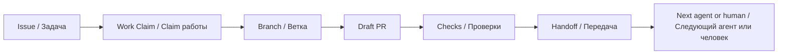

# Agent Handoff

[](AGENT_HANDOFF_STANDARD.md)
[](docs/en/README.md)
[](ai/GITHUB_WORKFLOW.md)
[](ai/AGENT_IDENTITY.md)

Agent Handoff is a GitHub-native standard for passing project context between AI coding agents, human maintainers, and human-supervised agents.

Agent Handoff — GitHub-native стандарт передачи проектного контекста между AI-агентами, людьми-maintainers и агентами под контролем человека.

## Why this exists / Зачем это нужно

AI coding agents often lose context between sessions, tools, branches, and pull requests. Chat history is not enough for medium repositories where several humans and agents may work in parallel.

AI-агенты часто теряют контекст между сессиями, инструментами, branches и pull requests. Истории чата недостаточно для средних репозиториев, где параллельно работают люди и агенты.

Agent Handoff keeps durable context where development already happens:

Agent Handoff хранит устойчивый контекст там, где уже идёт разработка:

```text
GitHub = Issues, Pull Requests, reviews, checks, labels, comments, ownership
Git    = branches, commits, diffs, tags, history
ai/    = compact durable project memory and agent protocols
```

## Core idea / Основная идея



## Who it is for / Для кого

- maintainers coordinating AI-assisted development / maintainers, координирующие AI-разработку;
- developers using Codex-like coding agents / разработчики, использующие Codex-like агентов;
- teams working with ChatGPT, Cursor, Claude Code, local agents, or custom LLM tools / команды с ChatGPT, Cursor, Claude Code, локальными агентами или custom LLM tools;
- projects that need visible ownership, compact memory, and safe handoff between runs / проекты, которым нужны видимый ownership, компактная память и безопасная передача между сессиями.

## Quick start / Быстрый старт

Choose the language that matches your repository.
Выберите язык, соответствующий вашему репозиторию.

| Language | Start here |
|---|---|
| English | [Open English documentation](docs/en/README.md) |
| Русский | [Открыть русскую документацию](docs/ru/README.md) |

### Copy-paste prompt / Prompt для копирования

```text
Add Agent Handoff to this repository.
Use the latest standard from https://github.com/artyomboyko/Agent_Handoff.
Inspect the current repository first.
Create or update the Agent Handoff files, GitHub Issue Forms, and Pull Request template.
Keep the repository language consistent.
Open a Pull Request and leave a compact handoff.
```

```text
Внедри Agent Handoff в этот репозиторий.
Используй последнюю версию стандарта из https://github.com/artyomboyko/Agent_Handoff.
Сначала изучи текущую структуру репозитория.
Создай или обнови файлы Agent Handoff, GitHub Issue Forms и Pull Request template.
Сохрани языковую согласованность репозитория.
Открой Pull Request и оставь компактный handoff.
```

## Principles / Принципы

1. GitHub is the source of work truth. / GitHub — источник правды по работе.
2. Git is the source of code truth. / Git — источник правды по коду.
3. `ai/` is compact durable memory. / `ai/` — компактная долговременная память.
4. Handoffs are short, structured, and reviewable. / Handoff короткий, структурированный и проверяемый.
5. Humans stay in control. / Люди сохраняют контроль.

## What is included / Что входит

| Area | File |
|---|---|
| Standard / Стандарт | [AGENT_HANDOFF_STANDARD.md](AGENT_HANDOFF_STANDARD.md) |
| Russian standard / Русский стандарт | [docs/ru/RU_STANDARD_FULL.md](docs/ru/RU_STANDARD_FULL.md) |
| GitHub workflow / GitHub workflow | [ai/GITHUB_WORKFLOW.md](ai/GITHUB_WORKFLOW.md) |
| Agent guide / Инструкция агента | [AGENTS.md](AGENTS.md) |
| Memory map / Карта памяти | [ai/README.md](ai/README.md) |
| Work claim / Claim работы | [ai/WORK_CLAIM_PROTOCOL.md](ai/WORK_CLAIM_PROTOCOL.md) |
| Agent identity / Идентификация агента | [ai/AGENT_IDENTITY.md](ai/AGENT_IDENTITY.md) |
| Refactoring workflow / Рефакторинг | [ai/REFACTORING.md](ai/REFACTORING.md) |
| Issue labels / Метки Issue | [ISSUE_LABELS.md](ISSUE_LABELS.md) |
| Issue status / Статусы Issue | [ISSUE_STATUS.md](ISSUE_STATUS.md) |
| FAQ / Вопросы | [FAQ.md](FAQ.md) |
| Examples / Примеры | [examples/](examples/) |

## Comparison / Сравнение

| Approach | What it keeps | Limitation |
|---|---|---|
| Chat memory | Conversation context | Tool-specific and session-bound |
| README only | Project overview | Not enough for active work ownership |
| Long LOG.md | Detailed history | Becomes noisy and hard to review |
| Wiki | Documentation | Often detached from branches and PRs |
| Agent Handoff | Compact project state, claims, handoffs | Requires small workflow discipline |

| Подход | Что хранит | Ограничение |
|---|---|---|
| Chat memory | Контекст разговора | Привязана к инструменту и сессии |
| Только README | Обзор проекта | Недостаточно для ownership текущей работы |
| Длинный LOG.md | Подробную историю | Быстро становится шумным |
| Wiki | Документацию | Часто отделена от branches и PR |
| Agent Handoff | Compact state, claims, handoffs | Требует небольшой дисциплины workflow |

## Natural search terms / Поисковые формулировки

Agent Handoff is related to AI coding agents, Codex-like agents, ChatGPT coding workflows, Cursor, Claude Code, LLM agents, project context, agent memory, GitHub workflow, multi-agent development, handoff protocol, pull request workflow, and human-agent collaboration.

Agent Handoff связан с AI coding agents, Codex-like agents, ChatGPT coding workflows, Cursor, Claude Code, LLM agents, project context, agent memory, GitHub workflow, multi-agent development, handoff protocol, pull request workflow и human-agent collaboration.

## For humans / Для людей

Use Agent Handoff to see who owns work, what changed, what was tested, what remains risky, and where the next contributor or agent should continue.

Используйте Agent Handoff, чтобы видеть, кто владеет работой, что изменилось, что проверено, какие риски остались и где продолжать следующему человеку или агенту.

## For agents / Для агентов

Start from `AGENTS.md`, read the required files, claim work in GitHub, open a Draft PR early, keep `ai/` compact, and leave a handoff when work is completed, paused, blocked, or transferred.

Начинайте с `AGENTS.md`, читайте обязательные файлы, фиксируйте claim в GitHub, рано открывайте Draft PR, держите `ai/` компактным и оставляйте handoff при завершении, паузе, блокировке или передаче работы.

## Repository visibility / Видимость репозитория

This repository is currently private during preparation. Before making it public, review secrets, history, generated files, and workflow logs.

Сейчас репозиторий готовится в private-режиме. Перед публикацией проверьте secrets, history, generated files и workflow logs.

## License / Лицензия

Planned license: AGPL-3.0. See [CHANGELOG.md](CHANGELOG.md) for version history.
