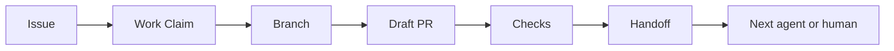

# Agent Handoff

[](AGENT_HANDOFF_STANDARD.md)
[](docs/en/README.md)
[](ai/GITHUB_WORKFLOW.md)
[](ai/AGENT_IDENTITY.md)

Agent Handoff is a GitHub-native standard for passing project context between AI coding agents, human maintainers, and human-supervised agents.

## Why this exists

AI coding agents often lose context between sessions, tools, branches, and pull requests. Chat history is not enough for medium repositories where several humans and agents may work in parallel.

Agent Handoff keeps durable context where development already happens:

```text
GitHub = Issues, Pull Requests, reviews, checks, labels, comments, ownership
Git    = branches, commits, diffs, tags, history
ai/    = compact durable project memory and agent protocols
```

## Core idea



## Who it is for

- maintainers coordinating AI-assisted development;
- developers using Codex-like coding agents;
- teams working with ChatGPT, Cursor, Claude Code, local agents, or custom LLM tools;
- projects that need visible ownership, compact memory, and safe handoff between runs.

## Quick start

Start with the English documentation: [docs/en/README.md](docs/en/README.md).

### Copy-paste prompt

```text
Add Agent Handoff to this repository.
Use the latest standard from https://github.com/artyomboyko/Agent_Handoff.
Inspect the current repository first.
Create or update the Agent Handoff files, GitHub Issue Forms, and Pull Request template.
Keep the repository language English unless the downstream project explicitly chooses another language.

Ask me a separate explicit question about Docker and Docker Compose organization before creating, moving, renaming, deleting, or consolidating any container files or paths.
Ask whether containerization is used or planned, which supported layout I want, whether an existing layout must be preserved or may be migrated, and whether production deployment configuration belongs in this repository or a separate deployment repository.
Do not infer the answer or choose the recommended layout automatically.

Open a Pull Request and leave a compact handoff.
```

## Principles

1. GitHub is the source of work truth.
2. Git is the source of code truth.
3. `ai/` is compact durable memory.
4. Handoffs are short, structured, and reviewable.
5. Humans stay in control of structural and migration decisions.

## What is included

| Area | File |
|---|---|
| Standard | [AGENT_HANDOFF_STANDARD.md](AGENT_HANDOFF_STANDARD.md) |
| GitHub workflow | [ai/GITHUB_WORKFLOW.md](ai/GITHUB_WORKFLOW.md) |
| Agent guide | [AGENTS.md](AGENTS.md) |
| Memory map | [ai/README.md](ai/README.md) |
| Work claim | [ai/WORK_CLAIM_PROTOCOL.md](ai/WORK_CLAIM_PROTOCOL.md) |
| Task reports | [ai/TASK_REPORT_PROTOCOL.md](ai/TASK_REPORT_PROTOCOL.md) |
| Agent identity | [ai/AGENT_IDENTITY.md](ai/AGENT_IDENTITY.md) |
| Refactoring workflow | [ai/REFACTORING.md](ai/REFACTORING.md) |
| Containerization | [ai/CONTAINERIZATION.md](ai/CONTAINERIZATION.md) |
| Issue labels | [ISSUE_LABELS.md](ISSUE_LABELS.md) |
| Issue status | [ISSUE_STATUS.md](ISSUE_STATUS.md) |
| FAQ | [FAQ.md](FAQ.md) |
| Examples | [examples/](examples/) |

## Comparison

| Approach | What it keeps | Limitation |
|---|---|---|
| Chat memory | Conversation context | Tool-specific and session-bound |
| README only | Project overview | Not enough for active work ownership |
| Long LOG.md | Detailed history | Becomes noisy and hard to review |
| Wiki | Documentation | Often detached from branches and PRs |
| Agent Handoff | Compact project state, claims, handoffs | Requires small workflow discipline |

## Natural search terms

Agent Handoff is related to AI coding agents, Codex-like agents, ChatGPT coding workflows, Cursor, Claude Code, LLM agents, project context, agent memory, GitHub workflow, multi-agent development, handoff protocol, pull request workflow, containerization decisions, Docker Compose organization, and human-agent collaboration.

## For humans

Use Agent Handoff to see who owns work, what changed, what was tested, what remains risky, and where the next contributor or agent should continue.

## For agents

Start from `AGENTS.md`, read the required files, claim work in GitHub, ask for required user decisions, open a Draft PR early, keep `ai/` compact, and leave a handoff when work is completed, paused, blocked, or transferred.

## Repository visibility

This repository is public. Before reusing the standard in your own public repository, review repository history, generated files, and workflow logs.

## License

License: GPL-3.0. See [CHANGELOG.md](CHANGELOG.md) for version history.
